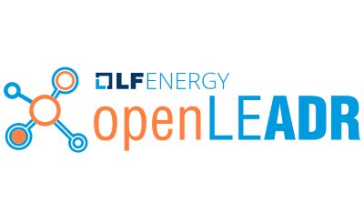

<section>

<h2>LF Energy Foundation Logos</h2>
    

Use of any trademark or logo is subject to the trademark policy available at <a href="https://www.linuxfoundation.org/trademark-usage">https://www.linuxfoundation.org/trademark-usage</a> with the key excepts available at <a href="LICENSE.md">LICENSE.md</a>. Questions? Please email <a href="mailto:info@lfenergy.org">info@lfenergy.org</a>.

<h3>Early Adoption Projects</h3>

<a href="projects#grid-exchange-fabric">

View Logos »

</a>

<a href="projects#riaps">

View Logos »

</a>

<a href="projects#powsysbl">

View Logos »

</a>

<a href="projects#operatorfabric">

View Logos »

</a>

<a href="projects#openeemeter">

View Logos »

</a>

<a href="projects#em2">

View Logos »

</a>

<a href="projects#openleadr">

View Logos »

</a>

<h3>Incubating Projects</h3>

<a href="projects#compas">

View Logos »

</a>

<h3>Other Logos</h3>

<a href="other#lf-energy-foundation-logos">

View Logos »

</a>

<a href="other#linux-foundation-member-logos">

View Logos »

</a>

</section>
