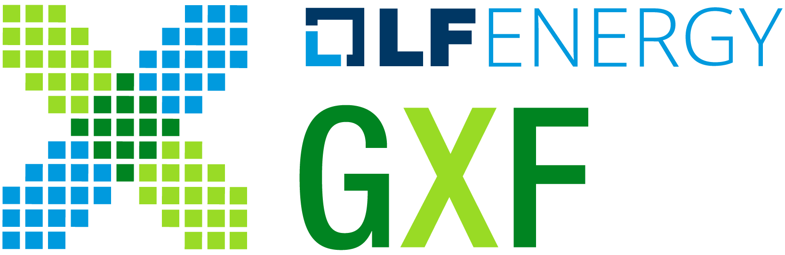
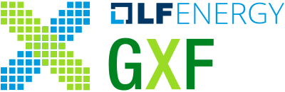
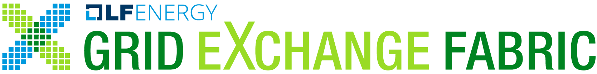
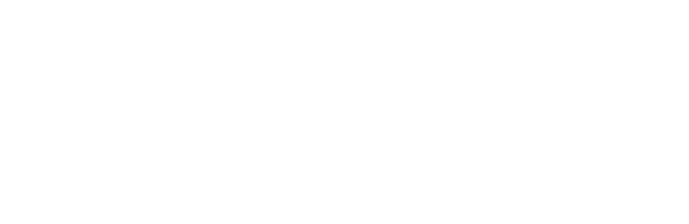
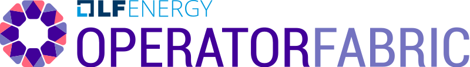
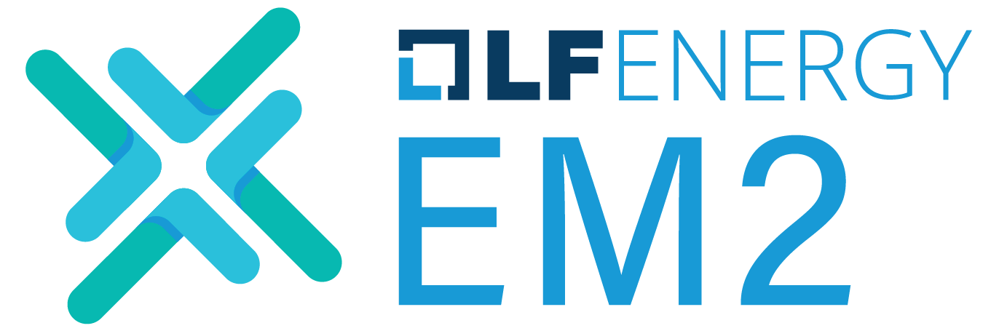
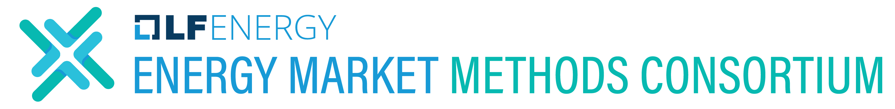
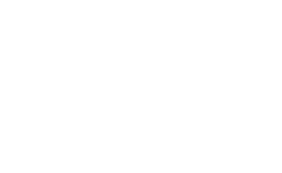
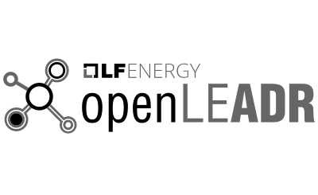

## Other Logos

*Note: GitHub Flavored Markdown used in the Readme doesn't support background colors. The white logos below are displayed on the light grey of tables.*

### Grid eXchange Fabric

<table class="logos-table">
  <thead>
    <tr>
      <th></th>
      <th colspan="2">Abbreviation</th>
      <th colspan="2">Full Name</th>
    </tr>
    <tr>
      <th></th>
      <th>PNG</th>
      <th>SVG</th>
      <th>PNG</th>
      <th>SVG</th>
    </tr>
  </thead>
  <tbody>
        <tr>
            <th>color</th>
            <td></td>
            <td></td>
            <td></td>
            <td></td>
        </tr>
        <tr>
            <th>white</th>
            <td></td>
            <td></td>
            <td></td>
            <td></td>
        </tr>
        <tr>
            <th>black</th>
            <td></td>
            <td></td>
            <td></td>
            <td></td>
        </tr>
    </tbody>
</table>

### RIAPS

<table class="logos-table">
	<thead>
        <tr>
            <th></th>
            <th>PNG</th>
            <th>SVG</th>
        </tr>
    </thead>
    <tbody>
        <tr>
            <th>color</th>
            <td></td>
            <td></td>
        </tr>
        <tr>
            <th>white</th>
            <td></td>
            <td></td>
        </tr>
        <tr>
            <th>black</th>
            <td></td>
            <td></td>
        </tr>
    </tbody>
</table>

### PowSyBl

<table class="logos-table">
	<thead>
        <tr>
            <th></th>
            <th>PNG</th>
            <th>SVG</th>
        </tr>
    </thead>
    <tbody>
        <tr>
            <th>color</th>
            <td></td>
            <td></td>
        </tr>
        <tr>
            <th>white</th>
            <td></td>
            <td></td>
        </tr>
        <tr>
            <th>black</th>
            <td></td>
            <td></td>
        </tr>
    </tbody>
</table>

### OperatorFabric

<table class="logos-table">
	<thead>
        <tr>
            <th></th>
            <th>PNG</th>
            <th>SVG</th>
        </tr>
    </thead>
    <tbody>
        <tr>
            <th>color</th>
            <td></td>
            <td></td>
        </tr>
        <tr>
            <th>white</th>
            <td></td>
            <td></td>
        </tr>
        <tr>
            <th>black</th>
            <td></td>
            <td></td>
        </tr>
    </tbody>
</table>

### OpenEEMeter

<table class="logos-table">
	<thead>
        <tr>
            <th></th>
            <th>PNG</th>
            <th>SVG</th>
        </tr>
    </thead>
    <tbody>
        <tr>
            <th>color</th>
            <td></td>
            <td></td>
        </tr>
        <tr>
            <th>white</th>
            <td></td>
            <td></td>
        </tr>
        <tr>
            <th>black</th>
            <td></td>
            <td></td>
        </tr>
    </tbody>
</table>

### EM2

<table class="logos-table">
  <thead>
    <tr>
      <th></th>
      <th colspan="2">Abbreviation</th>
      <th colspan="2">Full Name</th>
    </tr>
    <tr>
      <th></th>
      <th>PNG</th>
      <th>SVG</th>
      <th>PNG</th>
      <th>SVG</th>
    </tr>
  </thead>
  <tbody>
        <tr>
            <th>color</th>
            <td></td>
            <td></td>
            <td></td>
            <td></td>
        </tr>
        <tr>
            <th>white</th>
            <td></td>
            <td></td>
            <td></td>
            <td></td>
        </tr>
        <tr>
            <th>black</th>
            <td></td>
            <td></td>
            <td></td>
            <td></td>
        </tr>
    </tbody>
</table>

### OpenLEADR

<table class="logos-table">
	<thead>
        <tr>
            <th></th>
            <th>PNG</th>
            <th>SVG</th>
        </tr>
    </thead>
    <tbody>
        <tr>
            <th>color</th>
            <td></td>
            <td></td>
        </tr>
        <tr>
            <th>white</th>
            <td></td>
            <td></td>
        </tr>
        <tr>
            <th>black</th>
            <td></td>
            <td></td>
        </tr>
    </tbody>
</table>

### CoMPAS

<table class="logos-table">
	<thead>
        <tr>
            <th></th>
            <th>PNG</th>
            <th>SVG</th>
        </tr>
    </thead>
    <tbody>
        <tr>
            <th>color</th>
            <td></td>
            <td></td>
        </tr>
        <tr>
            <th>white</th>
            <td></td>
            <td></td>
        </tr>
        <tr>
            <th>black</th>
            <td></td>
            <td></td>
        </tr>
    </tbody>
</table>
